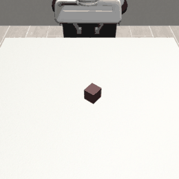
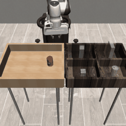
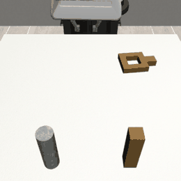
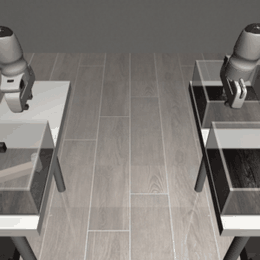
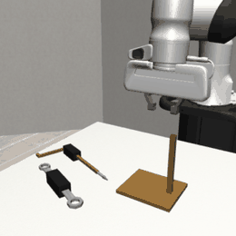
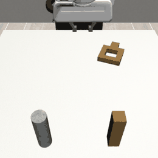
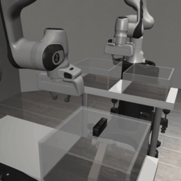

<h1 align="center">robomimic-cfm</h1>

<p align="center">
  
  
  
  
  
</p>

<p align="center">
  <b>A Conditional Flow Matching policy for <a href="https://github.com/ARISE-Initiative/robomimic">robomimic</a> — a drop-in, faster alternative to Diffusion Policy.</b>
</p>

<p align="center">
  <a href="#installation">Installation</a> &nbsp;•&nbsp;
  <a href="#quickstart">Quickstart</a> &nbsp;•&nbsp;
  <a href="#results">Results</a> &nbsp;•&nbsp;
  <a href="#how-it-works">How it works</a> &nbsp;•&nbsp;
  <a href="docs/CONDITIONAL_FLOW_MATCHING.md">Design notes</a> &nbsp;•&nbsp;
  <a href="https://github.com/ARISE-Initiative/robomimic">robomimic</a>
</p>

<p align="center">
  
  
  
</p>

-------

## Latest Updates
- [07/19/2026] Image observations for the transformer backbone across Square, Transport and Tool Hang. Two camera views take Square from ~0.40 to **1.00**, past the low-dim UNet; Transport and Tool Hang do not follow (0.60 / 0.10), so vision fixes an observability bottleneck rather than task difficulty. Includes GPU (EGL) dataset rendering, ~100× faster than software OSMesa.
- [07/17/2026] **v0.1.0** Added a Transformer (1D DiT) backbone alongside the UNet, with AdaLN-Zero conditioning on flow time + observations. Select it with `algo.transformer.enabled=true`.
- [07/16/2026] Full 3-seed benchmark sweep across all five `low_dim` proficient-human tasks; CFM matches or beats Diffusion Policy, notably **+11.7 points on Square**.
- [07/15/2026] Inference-speed benchmarks: **11× faster** than DDPM-100 at the default 10-step setting on an identical 65M-parameter UNet.
- [07/14/2026] Initial release — `"flow_matching"` registered as a drop-in robomimic algorithm; trains, checkpoints, and rolls out through the stock robomimic pipeline with no changes to robomimic.

-------

**robomimic-cfm** packages a **Conditional Flow Matching (CFM)** policy as a standalone,
drop-in alternative to Diffusion Policy for [robomimic](https://github.com/ARISE-Initiative/robomimic).
The package layers on top of robomimic rather than forking it: importing it registers a
`"flow_matching"` algorithm with robomimic's factories, after which the policy behaves
exactly like a built-in algorithm across training, checkpointing, and rollout.

Instead of learning to denoise, it reuses robomimic's observation encoder and
`ConditionalUnet1D` backbone to learn a **velocity field** `v(x_t, t, obs)` along the
straight-line path from Gaussian noise to action sequences. At inference, actions are
generated by integrating the learned ODE with **10 Euler steps** (versus 100 DDPM
denoising steps), receding-horizon style, matching the Diffusion Policy control loop.

## Core Features
- **Drop-in robomimic algorithm** — `import robomimic_cfm` registers `"flow_matching"`; everything else (trainer, checkpointing, rollout, resume) is stock robomimic.
- **Two interchangeable backbones** — the Diffusion Policy `ConditionalUnet1D`, or a 1D DiT Transformer (`ConditionalTransformer1D`) with the exact same call signature.
- **Fast few-step inference** — near-straight probability paths integrate in 5–10 Euler steps; **11× faster** than DDPM-100 at matched quality.
- **Simple objective** — plain regression onto a closed-form target velocity; no noise schedules or scheduler library at training time.
- **Low-dim or image observations** — camera inputs need no code change, only config; dataset generation and cluster training helpers are included ([Image observations](#image-observations)).
- **Fully reproducible** — the commit-pinned robomimic fork and all 30 sweep configs are included; `uv sync` reproduces the exact locked environment.

## Results

Evaluated on the `low_dim`, proficient-human (`ph`) robomimic datasets. The GIFs above
are rollouts of the trained flow-matching policy (10 Euler steps) on each task.

### Success rate vs. Diffusion Policy

Matched training budget (1000 epochs × 100 steps/epoch, batch size 256), using the same
encoder and `ConditionalUnet1D` backbone. Values are **mean ± std over 3 seeds**,
reporting the best checkpoint by rollout success (n = 20 rollouts per evaluation, i.e. 5%
resolution). CFM uses 10 Euler steps; Diffusion Policy uses DDPM-100.

| Task      | Flow Matching   | Diffusion Policy | BC-RNN (ref) |
|-----------|-----------------|------------------|--------------|
| Lift      | **100.0 ± 0.0** | 100.0 ± 0.0      | ~100         |
| Can       | **100.0 ± 0.0** | 100.0 ± 0.0      | ~100         |
| Square    | **56.7 ± 8.5**  | 45.0 ± 7.1       | ~84          |
| Tool Hang | 75.0 ± 7.1      | **80.0 ± 7.1**   | ~67          |
| Transport | 81.7 ± 2.4      | **86.7 ± 8.5**   | ~71          |

CFM is competitive with Diffusion Policy across the board: matched on the easy tasks,
clearly ahead on **Square** (the hardest precision task, +11.7 points), and slightly
behind on Tool Hang and Transport.

### Inference speed

Per action-chunk latency on the identical 65M-parameter UNet (RTX PRO 6000, 100 trials):

| Sampler                         | Latency (ms/chunk) | Speedup vs. DDPM-100 |
|---------------------------------|--------------------|----------------------|
| FM Euler, 1 step                | **3.11 ± 0.02**    | 94.4×                |
| FM Euler, 5 steps               | 13.44 ± 0.09       | 21.9×                |
| FM Euler, 10 steps *(default)*  | 26.68 ± 0.14       | **11.0×**            |
| FM midpoint, 5 steps            | 26.92 ± 0.14       | 10.9×                |
| DP DDIM, 10 steps               | 28.91 ± 0.10       | 10.2×                |
| DP DDPM, 100 steps              | 293.72 ± 0.61      | 1.0×                 |

At its default quality setting, CFM is **11× faster** than the standard DDPM-100 sampler.
Against DDIM-10 (the same number of network evaluations) it is at wall-clock parity; its
advantage there is quality retained at few steps rather than raw speed.

### Transformer backbone and image observations (exploratory)

<p align="center">
  
  
</p>

Single-seed runs of the 1D DiT backbone (1000 epochs, n = 10 rollouts per evaluation),
separate from the 3-seed sweep above — treat these as directional, not benchmark numbers.
Image runs use robomimic's canonical per-task cameras and resolution, with a ResNet18 +
SpatialSoftmax encoder and a `CropRandomizer`.

| Task      | Transformer `low_dim` | **Transformer, images** | UNet `low_dim` *(3-seed ref)* |
|-----------|-----------------------|-------------------------|-------------------------------|
| Lift      | ~1.00                 | —                       | 100.0 ± 0.0                   |
| Square    | ~0.40                 | **1.00**                | 56.7 ± 8.5                    |
| Transport | —                     | 0.60                    | 81.7 ± 2.4                    |
| Tool Hang | —                     | 0.10                    | 75.0 ± 7.1                    |

**Images are not a general win — they fix an observability bottleneck.** On **Square** the
transformer plateaus at 0.25–0.40 from `low_dim` and oscillates there for 700 epochs, even
though its training loss matches Lift's: the velocity objective is fit, but the fine
observation-dependent corrections a precision task needs are not. Two camera views
(`agentview` + `robot0_eye_in_hand`, 84×84) take it to **1.00** by epoch 300 — the
bottleneck was the observation modality, not the architecture.

That does not transfer to the tasks where low-dimensional state already worked well.
**Transport** (4 cameras) reaches 0.60, and **Tool Hang** (240×240, the resolution its fine
insertion needs) never exceeds 0.10 — zero success at ten consecutive evaluations, despite
the *lowest* training loss of any run. Both remain well below their `low_dim` UNet
references. Vision addresses what the policy can *perceive*; it does not make a hard task
easy.

Reproduce with the `*_image.json` configs under
[`configs/transformer/`](configs/transformer/).

See [Image observations](#image-observations) for how to generate the datasets and
configure an image run.

## Installation

```bash
git clone https://github.com/souravselvaraj/Robomimic-Flowmatching.git
cd Robomimic-Flowmatching
uv sync
```

`uv sync` reproduces the exact locked environment from `uv.lock`, including robomimic
itself. The package depends on a commit-pinned robomimic fork, because the
diffusion-policy backbone it builds on predates the latest robomimic release on PyPI. No
additional steps are required.

<details>
<summary>Installing with pip instead of uv</summary>

```bash
pip install "robomimic @ git+https://github.com/souravselvaraj/robomimic@562c8e323485391a049b67be41990f527b0f07a2"
pip install -e .
```
</details>

Rollout-video rendering and the reproduction scripts require a few additional libraries:
`uv sync --extra extras` (or `pip install -e ".[extras]"`).

## Quickstart

Importing the package registers the algorithm:

```python
import robomimic_cfm                       # registers "flow_matching"
from robomimic.config import config_factory
config = config_factory(algo_name="flow_matching")
```

Train and evaluate on a robomimic task (datasets download via robomimic's own tooling):

```bash
# 1. Download a dataset (standard robomimic workflow)
python -m robomimic.scripts.download_datasets --tasks lift --dataset_types ph --hdf5_types low_dim

# 2. Train and evaluate through the full robomimic pipeline
python scripts/train.py --config configs/benchmark/fm_lift_seed1.json

# 3. (Optional) Render a rollout video — headless, software OSMesa, no X/EGL
MUJOCO_GL=osmesa PYOPENGL_PLATFORM=osmesa \
    python scripts/render_video.py --ckpt <path-to-checkpoint>.pth --dataset <dataset>.hdf5
```

`scripts/train.py` imports `robomimic_cfm` to register the algorithm and then delegates to
robomimic's own trainer, so the entire robomimic training pipeline — checkpointing,
rollouts, and resume — works unchanged. Adjust dataset and output paths in the configs for
your environment (see [configs/README.md](configs/README.md)).

### Choosing a backbone

Enable exactly one of the two velocity networks in the config:

```jsonc
"algo": {
  "unet":        { "enabled": true  },   // Diffusion Policy ConditionalUnet1D (default)
  "transformer": { "enabled": false }    // 1D DiT — set true (and unet false) to switch
}
```

Run the test suite (trains 5 variants end-to-end on CPU in a few minutes):

```bash
python tests/test_flow_matching.py
```

## Image observations

The algorithm consumes camera observations without any code change — it builds its
observation encoder from robomimic's `ObservationGroupEncoder`, so images are purely a
config matter. Getting the data and the settings right is the work.

### 1. Generate the dataset

robomimic v1.5 **distributes no image HDF5s**; `download_datasets.py` will tell you to
create them locally. Render them from the low-dim demos' simulator states:

```bash
# sbatch scripts/render_image_dataset.sbatch <task> <resolution> <camera...>
sbatch scripts/render_image_dataset.sbatch square    84  agentview robot0_eye_in_hand
sbatch scripts/render_image_dataset.sbatch tool_hang 240 sideview robot0_eye_in_hand
sbatch scripts/render_image_dataset.sbatch transport 84 \
    shouldercamera0 shouldercamera1 robot0_eye_in_hand robot1_eye_in_hand
```

**Cameras and resolution are per-task**, and copying one task's settings onto another
silently produces near-zero success rather than an error — a 2-camera Transport policy
cannot see the second arm, and Tool Hang's fine insertion is unreadable at 84×84. These
match robomimic's own `scripts/extract_obs_from_raw_datasets.sh`:

| Task      | Resolution | Cameras                                                                  |
|-----------|-----------|---------------------------------------------------------------------------|
| Lift / Can / Square | 84×84  | `agentview`, `robot0_eye_in_hand`                                  |
| Tool Hang | **240×240** | `sideview`, `robot0_eye_in_hand`                                        |
| Transport | 84×84     | `shouldercamera0`, `shouldercamera1`, `robot0_eye_in_hand`, `robot1_eye_in_hand` |

Datasets are written **uncompressed on purpose**. Writing them with `--compress` produced
gzip chunks that raised `Can't synchronously read data (filter returned failure during
read)` on a handful of demos — and only when the whole dataset was read, so it surfaced at
training time rather than at generation time. Uncompressed costs disk (Tool Hang at
240×240 is ~33 GB) and avoids the problem entirely.

### 2. Configure the run

Start from an existing `*_image.json` under [configs/transformer/](configs/transformer/).
The parts that matter beyond the camera keys:

```jsonc
"train": {
  "hdf5_cache_mode": "low_dim",   // REQUIRED for images: "all" caches every decoded
                                  // sample in RAM and exhausts memory
  "num_data_workers": 4,
  "batch_size": 64                // 16 at 240x240; 32 for 4 cameras
},
"observation": { "encoder": { "rgb": {
  "core_class": "VisualCore",     // ResNet18 + SpatialSoftmax
  "obs_randomizer_class": "CropRandomizer",
  "obs_randomizer_kwargs": { "crop_height": 76, "crop_width": 76 }  // 216 at 240x240
}}}
```

Scale the crop with the resolution (76/84 ≈ 216/240) and reduce `batch_size` as pixels or
cameras go up.

### 3. Train

```bash
python scripts/train.py --config configs/transformer/fm_transformer_square_image.json
```

On a cluster, [`scripts/train_transformer_chain.sbatch`](scripts/train_transformer_chain.sbatch)
runs a config to completion unattended: each window resumes from `last.pth` and queues its
own successor (`--dependency=afterany`), so a crash or a wall-clock timeout is recovered
automatically. The chain stops itself once `train.num_epochs` is reached, and is capped at
12 windows so a persistently failing run cannot loop forever.

```bash
sbatch scripts/train_transformer_chain.sbatch configs/transformer/fm_transformer_square_image.json
```

## How it works

The policy learns a velocity field along the linear interpolant between Gaussian noise
`x₀ ~ N(0, I)` and the ground-truth action sequence:

```
x_t  = (1 - (1 - σ_min)·t)·x₀ + t·actions      # linear interpolant
u_t  = actions - (1 - σ_min)·x₀                # target velocity
loss = ‖ v_θ(x_t, t, obs) - u_t ‖²             # plain regression
```

With `σ_min = 0` this is exactly rectified flow (straight lines from noise to data). At
inference, actions are sampled by integrating `dx/dt = v_θ(x, t, obs)` from `t=0` to `t=1`
with a fixed number of Euler (or midpoint) steps.

robomimic's algorithm and config registries are plain, overwrite-safe dictionaries.
`robomimic_cfm` uses robomimic's own `register_algo_factory_func` decorator and
`ConfigMeta` metaclass, so importing the package registers `"flow_matching"` on top of any
robomimic install with no changes to robomimic required. See
[docs/CONDITIONAL_FLOW_MATCHING.md](docs/CONDITIONAL_FLOW_MATCHING.md) for the full design
and objective.

> **Note:** Actions must be normalized to `[-1, 1]` (standard robomimic datasets already
> are). The cosine LR schedule uses `step_every_batch=True`. If you write a custom training
> loop, step the scheduler **per gradient step** — otherwise the learning rate stays at 0
> through warmup.

## Reproducing the benchmarks

Every result can be reproduced with the matching config under [configs/](configs/) (all 30
runs of the 3-seed sweep are included). Download the datasets, edit the `train.data` /
`train.output_dir` paths (or regenerate the configs with
[scripts/gen_benchmark_configs.py](scripts/gen_benchmark_configs.py)), then run any config
through `scripts/train.py`. See [configs/README.md](configs/README.md) for details.

## Repository layout

```
robomimic_cfm/
  __init__.py                         # import-time registration of the algorithm + config
  flow_matching.py                    # FlowMatchingUNet (PolicyAlgo), registered as "flow_matching"
  transformer_nets.py                 # ConditionalTransformer1D (1D DiT) backbone
  config.py                           # FlowMatchingConfig (BaseConfig, ALGO_NAME="flow_matching")
  exps/templates/flow_matching.json   # generated config template
scripts/
  train.py                            # thin wrapper: registers the algo, hands off to robomimic
  render_image_dataset.sbatch         # generate image datasets from sim states (GPU/EGL)
  train_transformer_chain.sbatch      # self-resuming training chain (crash / timeout safe)
  train_transformer.sbatch            # single-window training job
  render_video.py                     # rollout video from a checkpoint
  benchmark_inference.py              # sampler latency benchmark
  gen_benchmark_configs.py            # regenerate the 3-seed sweep configs
tests/test_flow_matching.py           # 5 variants through train.py + reload + rollout
configs/
  benchmark/                          # 3-seed sweep, {fm,dp} x 5 tasks (reproduction)
  transformer/                        # 1D DiT configs, incl. *_image.json vision runs
assets/                               # rollout GIFs used in this README
docs/CONDITIONAL_FLOW_MATCHING.md     # design notes
```

## Troubleshooting

**Algorithm**

- **`actions must be in range [-1,1]`** — enable `train.hdf5_normalize_action` in the
  config; standard robomimic `ph` datasets are already normalized.
- **Learning rate stuck at 0** — the cosine schedule warms up per gradient step; keep
  `optim_params.policy.learning_rate.step_every_batch=true`.
- **Loss looks fine but rollout success is ~0** — expect this before suspecting a bug. The
  velocity-regression loss is dominated by the coarse noise→action direction, so a model
  can fit it well while missing the fine, observation-dependent corrections a precision
  task needs. Compare success curves, not losses; if the loss matches a task you *can*
  solve, the problem is usually observability or capacity.

**Image observations**

- **Near-zero success with a correct-looking image config** — check cameras and resolution
  against the [per-task table](#1-generate-the-dataset) first. Wrong settings fail
  silently, not loudly.
- **Host RAM exhausted / training stalls while "caching get_item calls"** — `hdf5_cache_mode`
  is `"all"` (the low-dim default), which caches every decoded sample. Set it to
  `"low_dim"` for image datasets.
- **`Can't synchronously read data (filter returned failure during read)`** — gzip-compressed
  image chunks that fail to decompress, often on only a few demos and only on a full read.
  Regenerate the dataset uncompressed (the provided render script does).
- **CUDA OOM** — lower `train.batch_size`: 240×240 or 4-camera runs need roughly 16–32
  rather than 64.

**Rendering (headless / cluster)**

- MuJoCo needs an offscreen GL backend: `MUJOCO_GL=egl` for GPU rendering,
  `MUJOCO_GL=osmesa` for software. EGL is ~100× faster (~1265 vs ~11 frames/sec here) and
  is worth fixing rather than working around — it dominates both dataset generation and
  image rollout evaluation.
- **`'NoneType' object has no attribute 'eglQueryString'`** — the EGL loader could not be
  dlopened. On GPU nodes this is usually *not* a missing driver: check whether
  `libEGL.so.1` (the vendor-neutral **GLVND loader**) exists, separately from
  `libEGL_nvidia.so.0` (the driver). Nodes here ship the driver, `libGLdispatch.so.0` and
  the vendor ICD but omit `libEGL.so.1`, so EGL init returns `None`. Supplying that one
  library (e.g. copying it from a host with the same distro/ABI onto shared storage and
  prepending its directory to `LD_LIBRARY_PATH`) restores hardware rendering; the sbatch
  scripts here do exactly that. Symlinking the *driver* as `libEGL.so.1` does not work —
  it fails with `undefined symbol: eglQueryString`, since the driver is only usable behind
  the loader.
- **`BlockingIOError: [Errno 11] write could not complete without blocking`** — an
  intermittent flush failure from tqdm/logging on some network filesystems that kills a
  run mid-training. It is not caused by the model. Use
  [`scripts/train_transformer_chain.sbatch`](scripts/train_transformer_chain.sbatch), which
  resumes from the last checkpoint automatically.

**Long runs**

- Resuming restores the config saved in the experiment directory, so editing the config
  file mid-run has no effect on a `--resume`. Start a fresh run to change hyperparameters.
- Software-rendered rollout evaluation is expensive (tens of minutes per evaluation).
  Lower `experiment.rollout.n` or raise `rate` if you cannot use GPU rendering.

## Citation

If you use this code, please cite this repository along with robomimic and the flow
matching / rectified flow papers it builds on:

```bibtex
@software{selvaraj_robomimic_cfm,
  author = {Selvaraj, Sourav},
  title  = {robomimic-cfm: A Conditional Flow Matching policy for robomimic},
  year   = {2026},
  url    = {https://github.com/souravselvaraj/Robomimic-Flowmatching}
}

@inproceedings{lipman2023flow,
  title     = {Flow Matching for Generative Modeling},
  author    = {Lipman, Yaron and Chen, Ricky T. Q. and Ben-Hamu, Heli and Nickel, Maximilian and Le, Matt},
  booktitle = {International Conference on Learning Representations (ICLR)},
  year      = {2023}
}

@inproceedings{liu2023rectified,
  title     = {Flow Straight and Fast: Learning to Generate and Transfer Data with Rectified Flow},
  author    = {Liu, Xingchao and Gong, Chengyue and Liu, Qiang},
  booktitle = {International Conference on Learning Representations (ICLR)},
  year      = {2023}
}

@inproceedings{robomimic2021,
  title     = {What Matters in Learning from Offline Human Demonstrations for Robot Manipulation},
  author    = {Mandlekar, Ajay and others},
  booktitle = {Conference on Robot Learning (CoRL)},
  year      = {2021}
}
```

## Author

Sourav Selvaraj — <krssourav@gmail.com>

## License

Released under the MIT License. See [LICENSE](LICENSE) for details.
